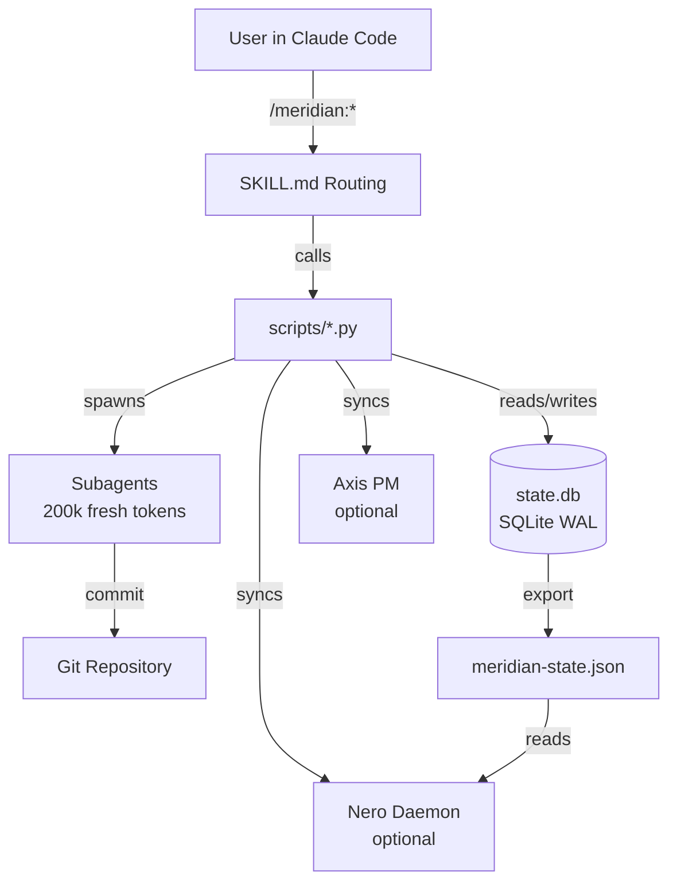
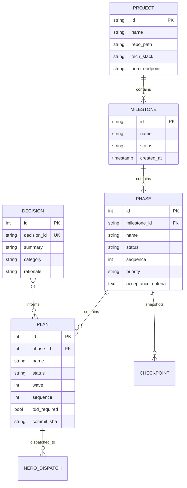
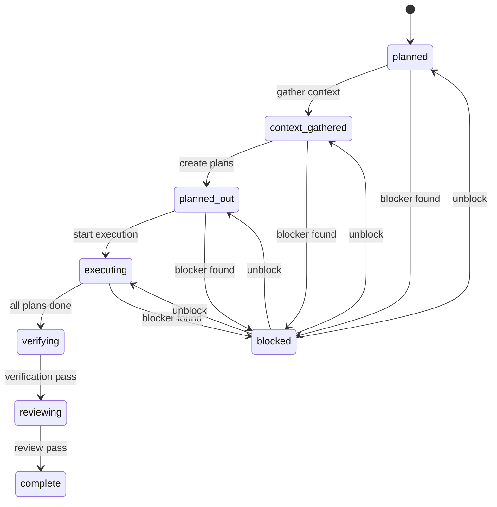
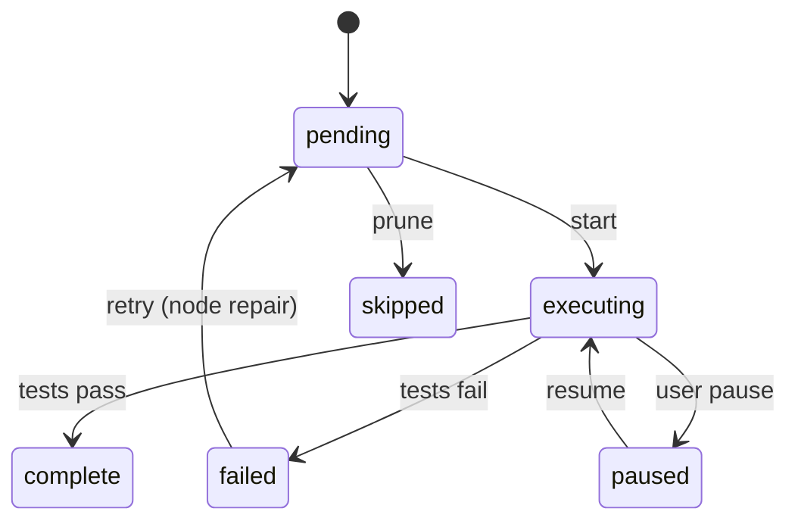
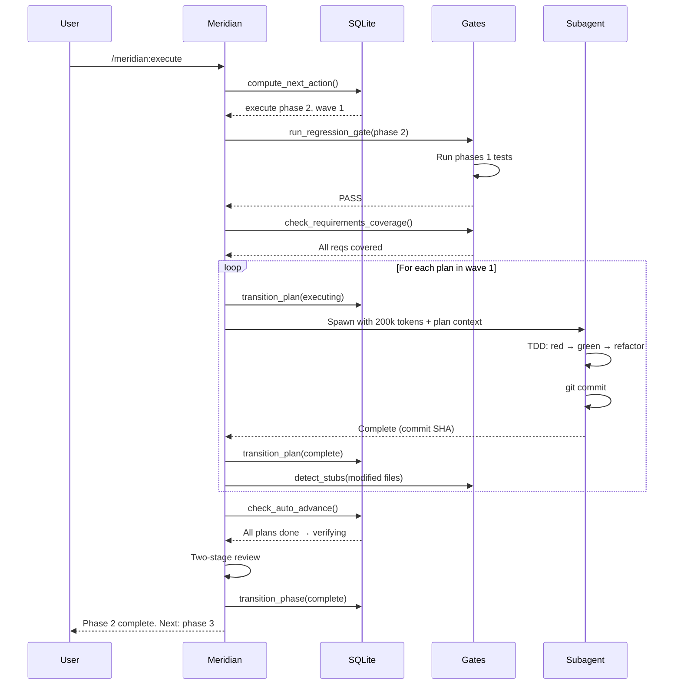
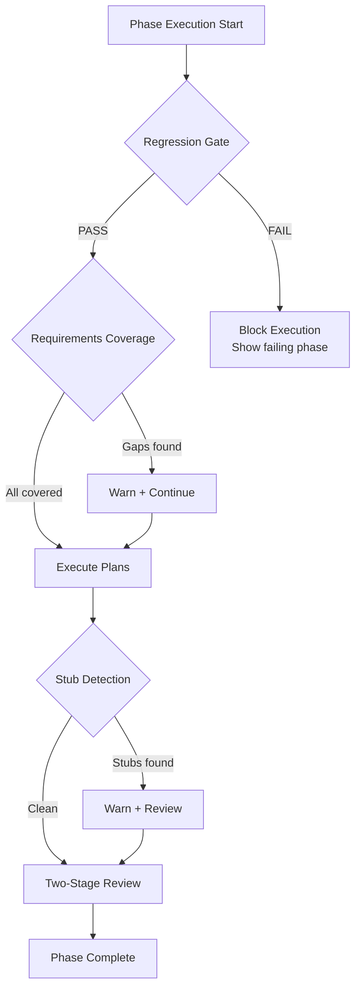
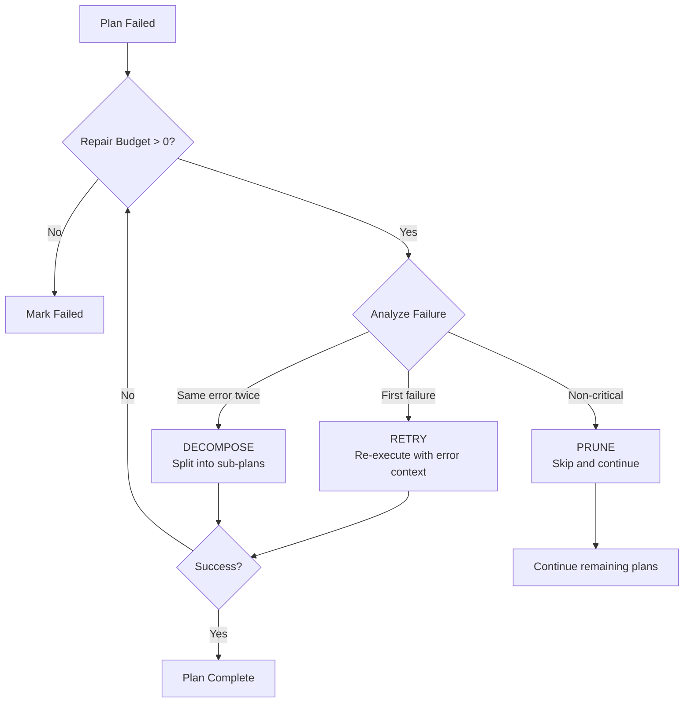

# Architecture Guide

How Meridian works under the hood.

## Design Principles

1. **Deterministic state** — All state lives in SQLite. Same DB = same behavior.
2. **Fresh context per task** — Each plan gets a 200k-token subagent. No context rot.
3. **Stdlib only** — Zero external dependencies. Works everywhere Python does.
4. **Quality by default** — Gates, detection, and review are automatic, not opt-in.
5. **Graceful degradation** — Every integration (Nero, MCP, Axis) fails silently.

## System Overview



## Command Routing

```mermaid
graph LR
    A[User types /meridian:plan] --> B[~/.claude/commands/meridian/plan.md]
    B -->|@ reference| C[skills/plan/SKILL.md]
    C -->|procedure calls| D[scripts/state.py<br>scripts/db.py]
```

1. Claude Code finds `plan.md` in `~/.claude/commands/meridian/`
2. The `.md` wrapper references the SKILL.md via `@` directive
3. SKILL.md contains the procedure (Python calls, bash commands, steps)
4. Procedure calls `scripts/*.py` modules for all logic

Command wrappers are auto-generated by `scripts/generate_commands.py` from `skills/*/SKILL.md` metadata.

## Data Model



## State Machine

### Phase Lifecycle



### Plan Lifecycle



## Execution Flow



## Quality Gate Pipeline



## Node Repair Flow



## Session Intelligence

```mermaid
graph LR
    subgraph "Active Session"
        Work[Working] -->|/meridian:pause| HJ[HANDOFF.json]
        Work -->|auto| Events[state_events]
        Debug[/meridian:debug] -->|resolved| KB[debug-kb.md]
        Discuss[Decisions] --> DL[DISCUSSION-LOG.md]
        Discuss --> DID[Decision IDs<br>DEC-NNN]
    end

    subgraph "New Session"
        Resume[/meridian:resume] -->|reads| HJ
        Resume -->|queries| DB2[(state.db)]
        Debug2[/meridian:debug] -->|searches| KB
        Plan2[/meridian:plan] -->|references| DID
    end
```

## File Organization

```
.meridian/                    # Per-project state (gitignored)
├── state.db                  # SQLite database (source of truth)
├── backups/                  # Auto-backups before migrations
├── notes.md                  # Captured notes
├── backlog.md                # Seeds with triggers
├── debug-kb.md               # Debug knowledge base
├── DISCUSSION-LOG.md         # Decision audit trail
├── HANDOFF.json              # Session handoff (temporary)
├── USER-PROFILE.md           # Developer profile
└── mcp-tools.json            # MCP tool config (optional)
```

## Module Dependency Graph

```mermaid
graph TB
    subgraph "Core"
        db[db.py<br>Schema + Migrations]
        state[state.py<br>CRUD + Transitions]
        resume[resume.py<br>Deterministic Resume]
    end

    subgraph "Quality"
        gates[gates.py<br>Regression + Coverage + Stubs]
        audit[audit.py<br>UAT Debt Tracking]
        nyquist[nyquist.py<br>VALIDATION.md Engine]
        security[security.py<br>Input Validation]
    end

    subgraph "Session"
        handoff[handoff.py<br>HANDOFF.json]
        debug_kb[debug_kb.py<br>Knowledge Base]
        discussion[discussion.py<br>Audit Trail]
    end

    subgraph "Quick"
        fast[fast.py<br>Inline Tasks]
        notes[notes.py<br>Note Capture]
        router[router.py<br>Text Router]
        next[next_action.py<br>Auto-Advance]
        backlog[backlog.py<br>Seeds]
    end

    subgraph "Execution"
        exec_modes[executor_modes.py<br>Interactive Mode]
        repair[node_repair.py<br>RETRY/DECOMPOSE/PRUNE]
        mcp[mcp_discovery.py<br>MCP Tools]
        ctx[context_awareness.py<br>Window Sizing]
    end

    subgraph "Integration"
        dispatch[dispatch.py<br>Nero Push]
        sync[sync.py<br>Nero Bidirectional]
        axis[axis_sync.py<br>PM Tickets]
        export[export.py<br>JSON Export]
        roadmap[roadmap_sync.py<br>Markdown Sync]
    end

    state --> db
    resume --> state
    resume --> handoff
    gates --> nyquist
    audit --> nyquist
    next --> state
    notes --> state
    handoff --> state
    sync --> dispatch
    roadmap --> state
    state --> security
